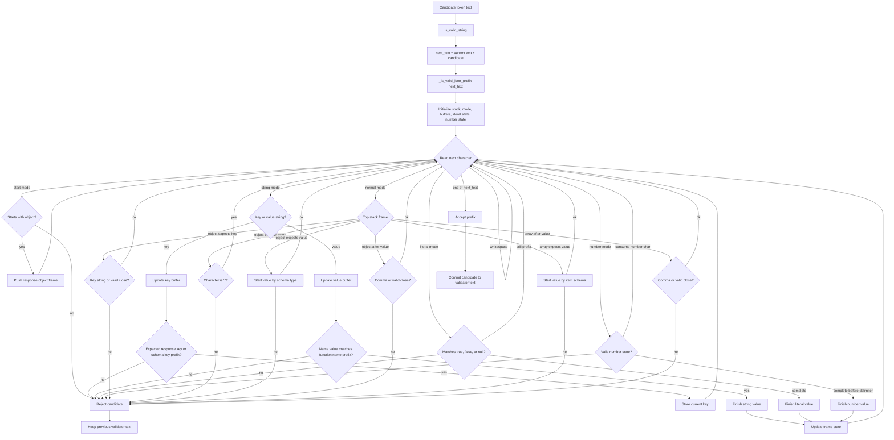

*This project has been created as part of the 42 curriculum by smiyata.*

# Call Me Maybe

## Overview

Call Me Maybe is a function-calling system for a small local LLM. It reads
natural-language requests and available function definitions, then writes a
machine-readable JSON file describing which function should be called and which
arguments should be passed.

The subject focuses on making a small model produce reliable structured output.
This implementation uses the provided `llm_sdk.Small_LLM_Model` wrapper with
`Qwen/Qwen3-0.6B` by default, and applies schema-aware constrained decoding so
invalid JSON or invalid function arguments are rejected during generation.

Example request:

```text
What is the sum of 2 and 3?
```

Example generated function call:

```json
{
  "prompt": "What is the sum of 2 and 3?",
  "name": "fn_add_numbers",
  "parameters": {
    "a": 2,
    "b": 3
  }
}
```

## Requirements

- Python 3.10 or later
- `uv`
- The provided `llm_sdk` package
- `flake8` and `mypy` checks through the Makefile

Project-specific constraints from the subject:

- The program must run with `uv run python -m src`.
- Classes use Pydantic models for validation.
- File, JSON, CLI, model-loading, and generation errors are handled gracefully.
- The output must be valid JSON and must follow the required schema exactly.
- The decoder must constrain generation, not only rely on prompting.

## Installation

```bash
make install
```

This runs:

```bash
uv sync
```

## Usage

Run with default paths:

```bash
uv run python -m src
```

Default input files:

- `data/input/functions_definition.json`
- `data/input/function_calling_tests.json`

Default output file:

- `data/output/function_calling_results.json`

All CLI options are optional:

```bash
uv run python -m src \
  --functions_definition data/input/functions_definition.json \
  --input data/input/function_calling_tests.json \
  --output data/output/function_calling_results.json \
  --model Qwen/Qwen3-0.6B
```

If `--model` is omitted, `Qwen/Qwen3-0.6B` is used.

## Makefile

```bash
make install
make run
make debug
make clean
make lint
make lint-strict
```

- `make run` runs the program with the default project input and output paths.
- `make lint` runs `flake8` and `mypy` with the subject flags.
- `make lint-strict` runs `make lint` and then `mypy --strict`.

## Input Files

### Prompt File

`function_calling_tests.json` must be a JSON array. Each item contains one
natural-language request:

```json
[
  {
    "prompt": "What is the sum of 2 and 3?"
  }
]
```

### Function Definition File

`functions_definition.json` must be a JSON array. Each function definition
contains:

- `name`: function name
- `description`: natural-language description
- `parameters`: argument names and schemas
- `returns`: return schema

Example:

```json
[
  {
    "name": "fn_add_numbers",
    "description": "Add two numbers together and return their sum.",
    "parameters": {
      "a": {
        "type": "number"
      },
      "b": {
        "type": "number"
      }
    },
    "returns": {
      "type": "number"
    }
  }
]
```

Supported schema types:

- `string`
- `number`
- `integer`
- `boolean`
- `object`
- `array`
- `null`

Objects define nested fields with `properties`. Arrays define their element
schema with `items`.

## Output File Format

The program writes a single JSON file to
`data/output/function_calling_results.json` by default. The file is a JSON
array with one object per input prompt.

Each output object contains exactly these keys:

- `prompt`: the original natural-language request
- `name`: the selected function name
- `parameters`: all required function arguments with the correct types

Example:

```json
[
  {
    "prompt": "What is the sum of 2 and 3?",
    "name": "fn_add_numbers",
    "parameters": {
      "a": 2,
      "b": 3
    }
  }
]
```

The output directory is created automatically if it does not already exist.

## LLM SDK Usage

The project uses the provided `Small_LLM_Model` wrapper from `llm_sdk`.

The generation path uses:

- `encode(text)`: convert the prompt into token IDs
- `get_logits_from_input_ids(input_ids)`: get raw logits for the next token
- `decode(token_ids)`: convert candidate token IDs back into text

`QwenClient` owns the model, tokenizer adapter, prompt builder, JSON validator,
and terminal visualizer.

## Generation Pipeline

Generation runs token by token:

1. `PromptBuilder` serializes function definitions and the current user prompt
   into an instruction prompt.
2. `QwenTokenizer` encodes the prompt with the SDK tokenizer.
3. `Small_LLM_Model.get_logits_from_input_ids()` returns next-token logits.
4. Candidate tokens are decoded back to text.
5. `JsonValidator` checks whether appending the candidate keeps the generated
   text valid as a JSON prefix and valid against the selected function schema.
6. Invalid candidates are rejected by setting their logits to negative infinity.
7. The best remaining valid token is appended.
8. The loop stops when the validator confirms the response is complete JSON.
9. `ResponseModel` validates the final object before it is written to disk.

## Constrained Decoding

The decoder does not rely only on prompt instructions. It filters tokens before
selection.

`JsonValidator` enforces:

- The generated response is a JSON object.
- Response keys appear as `prompt`, `name`, and `parameters`.
- `name` must match a function from `functions_definition.json`.
- `parameters` must match the schema for the selected function.
- Unknown parameter keys are rejected.
- Object values cannot close until all required schema keys are present.
- Value starts are constrained by type.
- Nested object and array schemas are validated recursively.
- Strings, numbers, literals, arrays, and objects are checked as JSON prefixes.

This improves reliability with a small model by preventing invalid tokens from
entering the output.

## JsonValidator Flowchart



## Validation Rules

The final output is validated in two stages:

- During generation, `JsonValidator` blocks structurally invalid JSON and
  schema-incompatible function arguments.
- After generation, `ResponseModel` forbids extra output keys and verifies that
  the response object has the expected fields.

The generated `prompt` must also match the original input prompt exactly.

## Error Handling

The CLI catches and reports:

- invalid CLI arguments
- duplicate CLI options
- missing files
- directories passed as files
- permission errors
- malformed JSON
- invalid input schemas
- invalid model identifiers or model-loading failures
- failed response generation after retries
- output write errors

Errors are printed as `Error: ...` messages instead of uncaught tracebacks.

## Performance And Reliability

The implementation targets the subject goals:

- 100% parseable JSON output
- schema-compliant function arguments
- high function-selection and argument-extraction accuracy on the provided
  prompts
- completion within the project time limit for the default input size
- robust behavior for missing files, malformed JSON, and invalid model names

The current decoder prioritizes correctness over raw speed because each token
candidate is checked before it is accepted.

## Implemented Bonus Features

- **Multiple model support**: `--model` can select a Hugging Face model ID.
- **Advanced error recovery**: invalid generated responses are fed back into a
  retry loop.
- **Generation visualization**: generated text, rejected tokens, and top token
  candidates are displayed during decoding.
- **Complex nested arguments**: object and array schemas are validated
  recursively.
- **Encoding/decoding integration**: token IDs are decoded for prefix validation
  and accepted tokens are appended back into the model input.

Not implemented:

- custom tokenizer reimplementation
- batching
- a comprehensive automated test suite

## Testing

Static checks:

```bash
make lint
make lint-strict
```

Manual checks:

- Run `uv run python -m src`.
- Confirm `data/output/function_calling_results.json` is valid JSON.
- Confirm every object contains exactly `prompt`, `name`, and `parameters`.
- Try missing input files.
- Try malformed JSON input files.
- Try unknown and duplicate CLI options.
- Try custom `--functions_definition`, `--input`, and `--output` paths.
- Try an invalid `--model` value and confirm it fails gracefully.
- Confirm nested object and array parameter schemas are accepted.

## Project Structure

```text
src/
  __main__.py
  json_io.py
  paths.py
  input_models/
    input_models.py
  function_call_generator/
    abc.py
    function_call_generator.py
    json_validator.py
    response_model.py
    visualizer.py
```

Key files:

- `src/__main__.py`: CLI parsing and top-level error handling
- `src/json_io.py`: JSON input loading and output writing
- `src/input_models/input_models.py`: prompt and function definition models
- `src/function_call_generator/function_call_generator.py`: prompt building,
  token generation, retries, and SDK integration
- `src/function_call_generator/json_validator.py`: constrained JSON and schema
  prefix validation
- `src/function_call_generator/response_model.py`: output response model
- `src/function_call_generator/visualizer.py`: terminal generation display

## Resources

- Project subject: `call_me_maybe.pdf`
- Pydantic documentation: https://docs.pydantic.dev/
- Python `json` documentation: https://docs.python.org/3/library/json.html
- Python `pathlib` documentation: https://docs.python.org/3/library/pathlib.html
- Qwen model family: https://qwenlm.github.io/

## AI Usage

AI assistance was used during implementation for:

- exploring the constrained decoding approach required by the subject
- enumerating the JSON prefix states handled by `JsonValidator`
- designing schema-aware validation for function names and parameters
- drafting and refining README explanations and flowcharts
- debugging CLI error handling and terminal visualization behavior

All generated suggestions were reviewed, adapted, and tested manually before
being kept in the repository.
